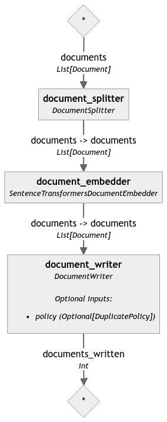
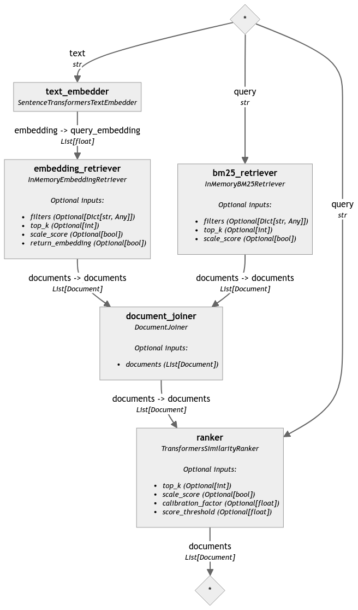

# Search Engine for a data collection Blockchain news system

## 1. Overview
Here, the Haystack framework is used to create our semantic search engine.  
With pre-trainedmodels being available on HuggingFace, this framework offers the archiecture that makes them work in practice.   The Python library comes with several **pre-configured pipelines**, where all we need to do is plug in the language model that works for us.   Our search engine makes use of both keyword-based and embedding-based retrieval techniques. 
* **Embedding-based**: Grasping the contextual nuances of the query
* **Keyword-based**: Matching keywords

## 2. Requirements
* Python: 3.10.0
* haystack-ai: 2.0.1
* farm-haystack: 1.25.5
* torchvision: 0.18.0+cu118
* torchaudio: 2.3.0+cu118
* pandas: 2.2.2

## 3. The Search Engine's structure
### 3.1. Database
For this particular project, the original data (several links of Blockchain articles and their information) is stored in an Excel file.   In the class **ExcelDB** located in the **BlockchainDB.py** file, you will see the method **process_data(numberOfArticles)**.   This method allows us to transform a arbitray number of articles into **Haystack Documents**, which are the inputs of our search engine. 

## 3.2. Indexing Pipeline
Indexing pipelins prepare our files for search, the main objective is to store the data in the **DocumentStore** with their embedding.   As an embedding model, we will use the **sentence-transformers/all-MiniLM-L6-v2** model on HuggingFace.

Using the **DocumentSplitter**, we split each Document into small chunks with overlapping words.  

These chunks will then be embedded by the **embedding model**.  

Finally, the **DocumentWriter** will write this embedded chunks into a **DocumentStore**.

## 3.3. Hybrid Retrieval Pipeline

* **Embedding-based retriever**  
Through the same **sentence-transformers/all-MiniLM-L6-v2** model, we compute the embeddding of the search query.   Then the **InMemoryEmbeddingRetriever** will compare the query and Document embeddings (generated from the **Indexing pipeline**) and fetch the Documents **most relevant** to the query from the **DocumentStore** based on the outcome.

* **Keyword-based retriever**  
**InMemoryBM25Retriever** is a keyword-based retriever that fetches Documents matching the input query based on the **BM25 algorithm**, which computes the weighted word overlap between the two strings.  
Further details of the algorithm can be found here: https://viblo.asia/p/bm25-thuat-toan-xep-hang-cac-van-ban-theo-do-phu-hop-Az45bWGNKxY 

* **DocumentJoiner**: Joining the documents coming from the 2 retrievers as the **Ranker** will be the main component to rank the documents for relevancy

* **Ranker BAAI/bge-reranker-base**: Rank the retrieved documents based on the relevancy points of them for the given search query based on the cross-encoder model.

## 4. Output
The search engine will return **a list of documents' indexes**.  
However, the use of the BM25 algorithm leads to duplicated search results. This calls for the static method **filter** in the class **SearchEngine**, which will remove the duplicated results.  
Of course, then the number of distinct results is affected. Still, this can be changed by declaring the **top_k** parameters in the following components:
* **InMemoryEmbeddingRetriever (currently 20)**: return the **(top_k)th** most relevant documents.
* **InMemoryBM25Retriever (currently 20)**: return the **(top_k)th** documents with highest relevancy scores. 
* **DocumentJoiner (currently 20)**: return the **(top_k)th** documents.
* **Ranker (currently 20)**: return the **(top_k)th** documents in the ranking list.  
----> <em>The larger the number of Documents ranked, the more Documents we choose from the **ranker**, the larger the number of distinct documents we can use as the output.</em>  

* **BlockchainDB.getIndex (currently 10)**: return the output. As a list, the length of it is **NO LARGER** than **top_k**.  
----> <em>The number of articles we will display on the Blockchain news system.</em>
